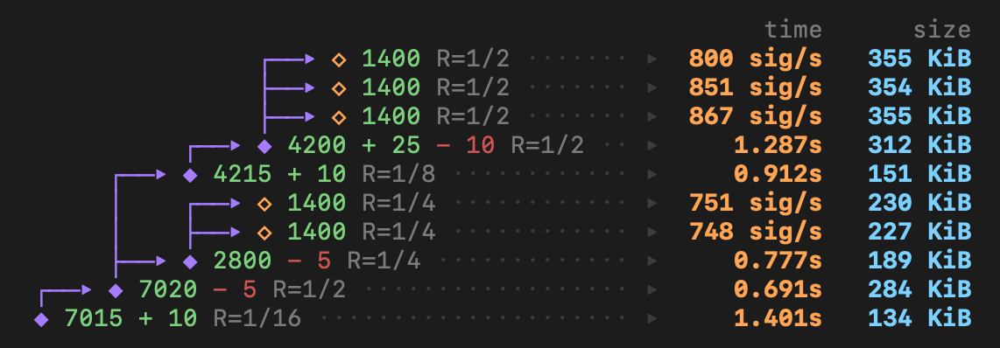

<h1 align="center">leanMultisig</h1>

<p align="center">
  
</p>

Minimal hash-based zkVM, targeting recursion and aggregation of hash-based signatures, for a Post-Quantum Ethereum.

Documentation: [PDF](minimal_zkVM.pdf)

## Proving System


- multilinear with [WHIR](https://eprint.iacr.org/2024/1586.pdf), allowing polynomial stacking (reducing proof size)
- [SuperSpartan](https://eprint.iacr.org/2023/552.pdf), with [AIR-specific optimizations](https://solvable.group/posts/super-air/#fnref:1)
- [Logup](https://eprint.iacr.org/2023/1284.pdf), with a system of buses similar to [OpenVM](https://openvm.dev/whitepaper.pdf)

The VM design is inspired by the famous [Cairo paper](https://eprint.iacr.org/2021/1063.pdf).


## Security

123 bits of provable security, given by Johnson bound + degree 5 extension of koala-bear. (128 bits would require hash digests of more than 8 field elements, todo?). In the benchmarks, we also display performance with conjectured security, even though leanVM targets the proven regime by default.

## Benchmarks

Machine: M4 Max 48GB (CPU only)

*Expect incoming perf improvements.*

### XMSS aggregation

```bash
cargo run --release -- xmss --n-signatures 1400
```

| WHIR rate \ regime | Proven               | Conjectured          |
| ------------------ | -------------------- | -------------------- |
| 1/2                | 775 XMSS/s - 374 KiB | 775 XMSS/s - 204 KiB |
| 1/4                | 650 XMSS/s - 246 KiB | 650 XMSS/s - 146 KiB |

(Proving throughput - proof size)

### Recursion

2 to 1 recursion (WHIR rate = 1/4):


```bash
cargo run --release -- recursion --n 2
```

| Proven          | Conjectured     |
| --------------- | --------------- |
| 0.77s - 223 KiB | 0.59s - 128 KiB |


### Bonus: unbounded recursive aggregation

```bash
cargo run --release -- fancy-aggregation
```



(Proven regime)

## Credits

- [Plonky3](https://github.com/Plonky3/Plonky3) for its various performant crates
- [whir-p3](https://github.com/tcoratger/whir-p3): a Plonky3-compatible WHIR implementation
- [Whirlaway](https://github.com/TomWambsgans/Whirlaway): Multilinear snark for AIR + minimal zkVM


