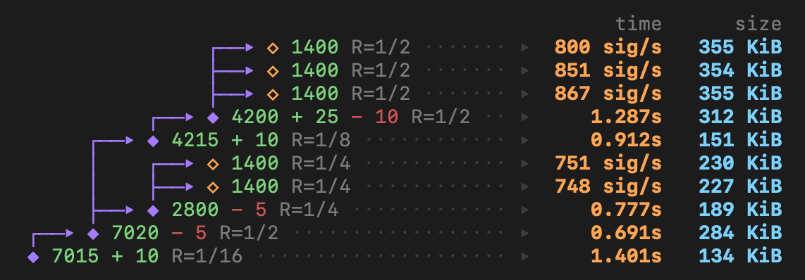

<h1 align="center">leanMultisig</h1>

<p align="center">
  
</p>

Minimal hash-based zkVM, targeting recursion and aggregation of hash-based signatures, for a Post-Quantum Ethereum.

Documentation: [PDF](minimal_zkVM.pdf)

## Proving System


- multilinear with [WHIR](https://eprint.iacr.org/2024/1586.pdf), allowing polynomial stacking (reducing proof size)
- [SuperSpartan](https://eprint.iacr.org/2023/552.pdf), with [AIR-specific optimizations](https://solvable.group/posts/super-air/#fnref:1)
- [Logup](https://eprint.iacr.org/2023/1284.pdf), with a system of buses similar to [OpenVM](https://openvm.dev/whitepaper.pdf)

The VM design is inspired by the famous [Cairo paper](https://eprint.iacr.org/2021/1063.pdf).


## Benchmarks

Machine: M4 Max 48GB (CPU only)

*Expect incoming perf improvements.*

### XMSS aggregation

```bash
cargo run --release -- xmss --n-signatures 1500 --log-inv-rate 1
```

| WHIR rate | Proven Regime         | Proximity Gaps Conjecture |
| --------- | --------------------- | ------------------------- |
| 1/2       | 1193 XMSS/s - 377 KiB | 1207 XMSS/s - 191 KiB     |
| 1/4       | 863 XMSS/s - 243 KiB  | 872 XMSS/s - 129 KiB      |

(Proving throughput - proof size)

### Recursion

Aggregating together n previously aggregated signatures, each containing 700 XMSS.


```bash
cargo run --release -- recursion --n 2 --log-inv-rate 2
```


| n   | WHIR rate | Proven Regime               | Proximity Gaps Conjecture   |
| --- | --------- | --------------------------- | --------------------------- |
| 1   | 1/2       | 0.35s = 1 x 0.35s - 256 KiB | 0.24s = 1 x 0.24s - 146 KiB |
| 1   | 1/4       | 0.33s = 1 x 0.33s - 183 KiB | 0.26s = 1 x 0.26s - 98 KiB  |
| 2   | 1/2       | 0.65s = 2 x 0.33s - 272 KiB | 0.43s = 2 x 0.21s - 157 KiB |
| 2   | 1/4       | 0.56s = 2 x 0.28s - 190 KiB | 0.41s = 2 x 0.21s - 101 KiB |
| 3   | 1/2       | 0.83s = 3 x 0.28s - 303 KiB | 0.62s = 3 x 0.21s - 150 KiB |
| 3   | 1/4       | 0.86s = 3 x 0.29s - 192 KiB | 0.71s = 3 x 0.24s - 107 KiB |
| 4   | 1/2       | 1.23s = 4 x 0.31s - 327 KiB | 0.76s = 4 x 0.19s - 166 KiB |
| 4   | 1/4       | 1.01s = 4 x 0.25s - 200 KiB | 0.76s = 4 x 0.19s - 106 KiB |


(time for n->1 recursive aggregation - proof size)

### Bonus: unbounded recursive aggregation

```bash
cargo run --release -- fancy-aggregation
```



(Proven regime)

## Security

### snark

≈ 124 bits of provable security, given by Johnson bound + degree 5 extension of koala-bear. (128 bits requires bigger hash digests (8 koalabears ≈ 248 bits) -> TODO). In the benchmarks, we also display performance with conjectured security, even though leanVM targets the proven regime by default.

### XMSS

Currently, we use an [XMSS](https://eprint.iacr.org/2025/055.pdf) with hash digests of 4 field elements ≈ 124 bits. Tweaks and public parameter ensure domain separation. An analysis in the ROM (resp. QROM), inspired by the section 3.1 of [Tight adaptive reprogramming in the QROM](https://arxiv.org/pdf/2010.15103) would lead to ≈ 124 (resp. 62) bits of classical (resp. quantum) security. Going to 128 / 64 bits of classical / quantum security, i.e. NIST level 1 (in the ROM/QROM), is an ongoing effort. It requires either:
- hash digests of 5 field elements (drawback: we need to double the hash chain length from 8 to 16 if we want to stay bellow one ip-v6 MTU = 1280 bytes)
- a new prime, close to 32 bits (typically p = 125.2^25 + 1) or 64 bits ([goldilocks](https://2π.com/22/goldilocks/))
It's important to mention that a security analysis in the ROM / QROM is not the most conservative. In particular, [eprint 2025/055](https://eprint.iacr.org/2025/055.pdf) security proof holds in the standard model (at the cost of bigger hash digests).

## Credits

- [Plonky3](https://github.com/Plonky3/Plonky3) for its various performant crates
- [whir-p3](https://github.com/tcoratger/whir-p3): a Plonky3-compatible WHIR implementation
- [Whirlaway](https://github.com/TomWambsgans/Whirlaway): Multilinear snark for AIR + minimal zkVM


