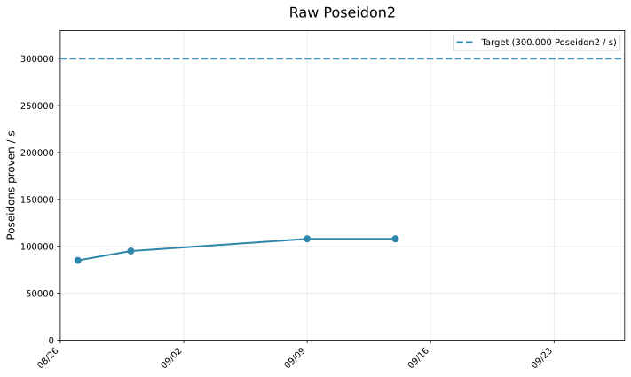
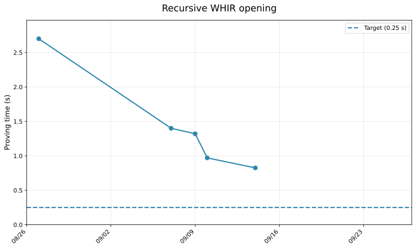
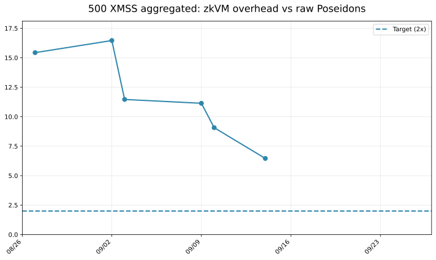

<h1 align="center">♦ leanMultisig ♦</h1>

XMSS + minimal [zkVM](minimal_zkVM.pdf) = lightweight PQ signatures, with unbounded aggregation

## Status

- branch [main](https://github.com/leanEthereum/leanMultisig): optimized for **prover efficiency**
- branch [lean-vm-simple](https://github.com/leanEthereum/leanMultisig/tree/lean-vm-simple): optimized for **simplicity**

Both versions will eventually merge into one.

## Proving System


- [WHIR](https://eprint.iacr.org/2024/1586.pdf)
- [SuperSpartan](https://eprint.iacr.org/2023/552.pdf), with AIR-specific optimizations developed by W. Borgeaud in [A simple multivariate AIR argument inspired by SuperSpartan](https://solvable.group/posts/super-air/#fnref:1)
- [Univariate Skip](https://eprint.iacr.org/2024/108.pdf)
- [Logup*](https://eprint.iacr.org/2025/946.pdf)
- ...

The VM design is inspired by the famous [Cairo paper](https://eprint.iacr.org/2021/1063.pdf).

## Benchmarks

Benchmarks are performed on 2 laptops:
- i9-12900H, 32 gb of RAM
- mac m4 max

target ≈ 128 bits of security, currently using conjecture: 4.12 of [WHIR](https://eprint.iacr.org/2024/1586.pdf), "up to capacity" (TODO: provable security)

### Poseidon2

Poseidon2 over 16 KoalaBear field elements.

```console
RUSTFLAGS='-C target-cpu=native' cargo run --release -- poseidon --log-n-perms 20
```



### Recursion


The full recursion program is not finished yet. Instead, we prove validity of a WHIR opening, with 25 variables, and rate = 1/4.

- 1-to-1: Recursive proof of a single WHIR opening
- n-to-1: Recursive proof of many WHIR openings (≈ 8) (we report prover time per WHIR)

```console
RUSTFLAGS='-C target-cpu=native' cargo run --release -- recursion --count 18
```




### XMSS aggregation

```console
RUSTFLAGS='-C target-cpu=native' cargo run --release -- xmss --n-signatures 1250
```

[Trivial encoding](docs/XMSS_trivial_encoding.pdf) (for now).




### Fibonacci:

n = 2,000,000

```
FIB_N=2000000 RUSTFLAGS='-C target-cpu=native' cargo test --release --package lean_prover --test test_zkvm -- --nocapture -- test_prove_fibonacci --exact --nocapture
```

Proving time:

- i9-12900H: 2.0 s (1.0 MHz)
- mac m4 max: 1.2 s (1.7 MHz)

### Proof size

With conjecture "up to capacity", and rate = 1/2, current proofs are about ≈ 400 - 500 KiB. On the [lean-vm-simple](https://github.com/leanEthereum/leanMultisig/tree/lean-vm-simple) branch, proofs are ≈ 300 KiB. This part has not (at all) been optimized (no Merkle pruning...): big gains are expected.

Target: 
- 256 KiB for fast proof (rate = 1/2)
- close to 128 KiB for slower proofs (rate = 1/4 or 1/8)

## Credits

- [Plonky3](https://github.com/Plonky3/Plonky3) for its various performant crates (Finite fields, poseidon2 AIR etc)
- [whir-p3](https://github.com/tcoratger/whir-p3): a Plonky3-compatible WHIR implementation
- [Whirlaway](https://github.com/TomWambsgans/Whirlaway): Multilinear snark for AIR + minimal zkVM


